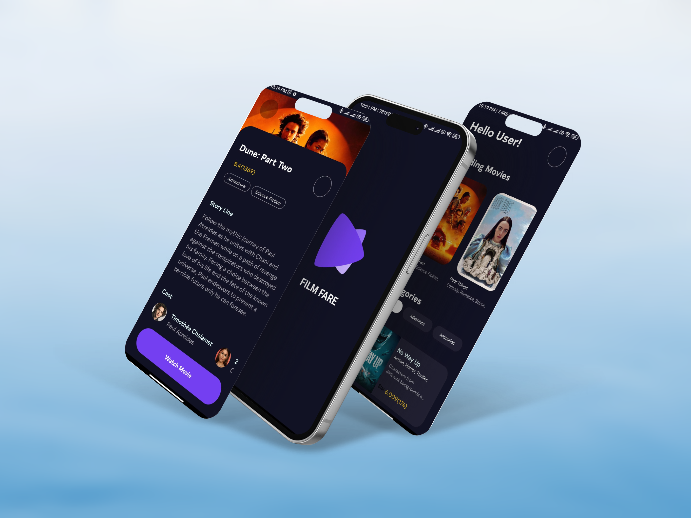
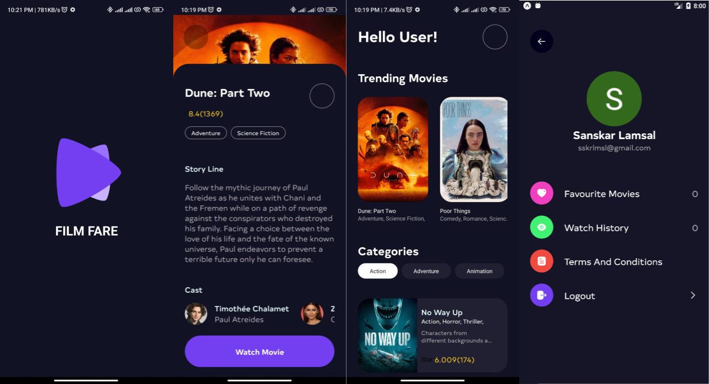

# Movie App

\
This is a React-based project that includes several screens and components.

## Getting Started

To get started with this project, clone the repository and install the dependencies with npm.

```sh
git clone <repository-url>
cd <repository-name>
npm install
npm start
```

## Project Features



- **User Authentication**:
  The `LoginScreen` provides user authentication. Users can log in to access personalized features.\

- **Home Screen**: The `HomeScreen` displays a list of movies. Users can browse through the list and select a movie to see more details.\

- **Movie Details**: The `MovieDetailsScreen` shows detailed information about a movie. Users can see the cast, watch the trailer, and read reviews.\

- **Favorites**: Users can add movies to their favorites list. The `FavouriteScreen` displays all the movies that a user has marked as favorites.\

- **Movie Player**: The `MoviePlayer` allows users to watch movies directly in the app.\

## Project Structure

The project is structured as follows:

- `src/components`: This directory contains reusable components like BigMovieCard, Button, Cast, and Icon.
- `src/context`: This directory includes the AppContext and utility functions in utils.
- `src/navigation`: This directory contains the main app navigation in AppStack.
- `src/screens`: This directory includes all the screens of the app like FavouriteScreen, HomeScreen, LoginScreen, MovieDetailsScreen, and MoviePlayer.

## API Details

This project uses the [TMDB API](https://api.themoviedb.org/3) to fetch movie data. The API provides information about movies, including title, genre, cast, and more.

### API Endpoints

- `/discover/movie`: Fetches a list of movies.
- `/trending/movie/week`: Fetches a list of trending movies of this week
- `/movie/{id}/credits`: Fetches the cast of a specific movie.

## Contributing

If you want to contribute to this project, please create a new branch and submit a pull request.

## License

This project is licensed under the MIT License.
